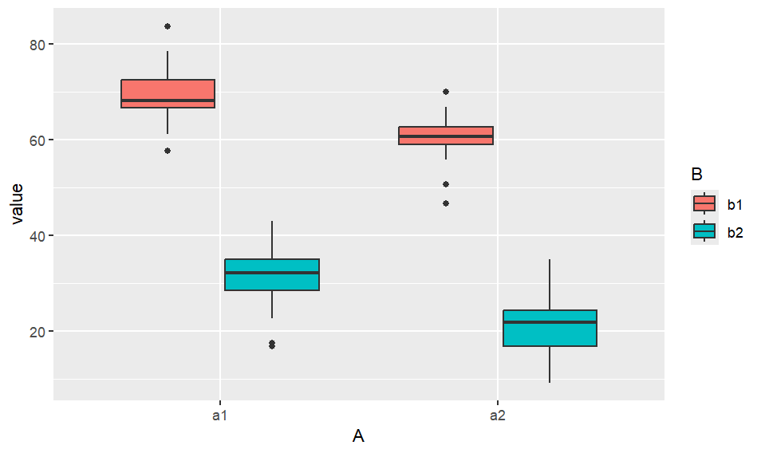

## 注意点
回答すべき数値に小数点以下の桁が生じて問題文では桁数が指定されていない場合は小数点以下第2位までを答えること。ただし問題文で桁数が指定されている場合は、それに従うこと。どちらの場合も、指定された桁数の下一桁を四捨五入して丸めることとする。

## 1
以下の文章を読み、内容に誤りがない場合は解答欄に〇を、誤りがあると考えた場合には、そう考えた理由を簡潔に記せ。誤りがある場合には×と書くのではなく、理由を書くことに注意すること。（各3点；計30点）
)

1. 心理学における有意水準は，0.05%に設定されることが多い。
2. 条件間の差に関する統計的検定で検証することができるのは、「差があるという仮説が真」ということだけである。
3. 要因が1つで実験条件が3つの場合，分散分析が適している。
4. 全ての参加者は，A条件とB条件の課題を両方とも実施する。A，Bの実施順は，参加者で異なる。この実験データを統計的に検定するには，対応なしの$t$検定を用いるべきである。
5. 要因が2つ設定された実験データを分散分析で解析したところ、2つの要因の主効果はいずれも有意だった。そのため、要因間の交互作用も有意であると考えられる。
6. 分散分析で用いる検定統計量$F$の分布は左右対称の形をしている。
7. 分散分析における帰無仮説は、全ての条件の分散が等しいというものである。
8. 条件間の差に関する統計的検定で有意な結果が得られた場合、得られるのは標本データにおいて条件間に差があったという結論である。
9. 分散分析において、2条件からなる要因の主効果が有意だった場合、多重比較による下位検定を行う必要がある。
10. 統計的検定において有意確率が小さいほど、その効果は大きい（あるいは差は大きい）と言える。

## 2
下に示すグラフと説明は、2つの要因（要因Aと要因B）を持ち、それぞれが2条件（A要因: a1条件, a2条件；B要因: b1条件, b2条件）からなる実験結果と、分散分析の結果を示している。グラフに示される結果と分散分析結果をもとに、正しい組み合わせを選べ。ただし、図において要因Aのa1条件とa2条件は横軸（a1が左、a2が右）に、要因Bのb1条件とb2条件は色の違い（b1が赤、b2が緑）としてあらわされている。また、箱ひげ図の箱の範囲は第一四分位と第三四分位、ひげの範囲は最大値と最小値を示す。（各3点；計12点）

- 説明A: 要因Aの主効果あり、要因Bの主効果あり、AとBの交互作用あり、b1条件におけるAの効果あり、b2条件におけるAの効果あり、a1条件におけるBの効果なし、a2条件におけるBの効果あり
- 説明B: 要因Aの主効果あり、要因Bの主効果あり、AとBの交互作用なし
- 説明C: 要因Aの主効果なし、要因Bの主効果なし
- 説明D: 要因Aの主効果なし、要因Bの主効果なし、AとBの交互作用あり、b1条件におけるAの効果あり、b2条件におけるAの効果あり、a1条件におけるBの効果あり、a2条件におけるBの効果あり

図A
{width=40%}

図B
{width=40%}

図C
{width=40%}

図D
{width=40%}

## 3
eシラバスからQ3data.csvをダウンロードし、条件d1と条件d2の間に得点（value）の差があるかどうかを$t$検定によって判断し、問いに答えよ。ただし、データ収集および母集団については以下の記述を参考にすること

- d1とd2のデータは異なる参加者群から得られており、データ数も異なる
- d1とd2の母集団の分散が等しいという仮定はおけないものとする

1. $t$値、自由度、有意確率をそれぞれ記せ。（各3点；計9点）
2. $t$検定の結果からどういう判断を行うべきか、記せ。（5点）

## 4
eシラバスからダウンロードできるQ4data.csvは、2要因それぞれ2水準（A要因の条件a1, a2; B要因の条件b1, b2）で実施された実験データである。適切な方法で分散分析を実施し、問いに答えよ。ただし、データ収集については以下の記述を参考にすること。

- 全ての条件は全て同じ参加者によって実施されている（1つの参加者群が全ての条件を実施している）

1. 分散分析を実施した結果として分かったことを全て記せ。下位検定を実施したことで分かったことも含めて記述すること。効果が認められた場合には、効果の方向（どちらの条件の方が値が大きいのか）も含めて示すべきであることに気をつけること。（14点）
